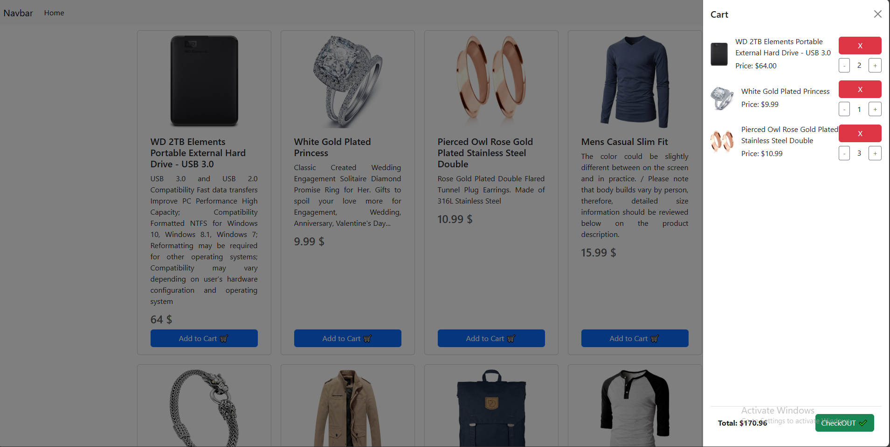

# Cart Project

This project is a simple shopping cart application built using HTML, CSS, and JavaScript. The cart allows users to add products, update quantities, and view the total price.

## Features

- Add products to the cart
- Check if the product already exists in the cart
- Update product quantities
- Remove products from the cart
- Display the total price

## Technologies Used

- HTML
- CSS (Bootstrap 5)
- JavaScript

## Getting Started

To get started with the project, follow these steps:

1. Clone the repository or download the project files.
2. Open the `index.html` file in your browser.

## Screenshots


*Description of Screenshot 1*


*Description of Screenshot 2*

## Code Overview

### Functional Programming Approach

The project follows a functional programming approach, where each task is encapsulated in a function. The cart is represented as an array of products, and various functions are used to manipulate this array.

### Key Concepts and Data Structures

- **Cart Array**: The cart is an array of product objects. Each product object contains properties such as `index`, `title`, `price`, `imgSrc`, `quantity`, and `totalPrice`.

- **Functions**:
  - `addToCart(index, title, price, imgSrc)`: Adds a product to the cart or updates the quantity if the product already exists.
  - `updateCartDisplay()`: Updates the cart display by creating and appending HTML elements for each product in the cart.
  - `updateQuantity(index, change)`: Updates the quantity of a product in the cart and removes it if the quantity is zero or less.

### API Used

This project uses the [Fake Store API](https://fakestoreapi.com/) to fetch product data. The API provides pseudo-real data for e-commerce or shopping website prototypes. Here's an example of how the API is used in the project:

```javascript
fetch('https://fakestoreapi.com/products/1')
    .then(res => res.json())
    .then(json => console.log(json));
